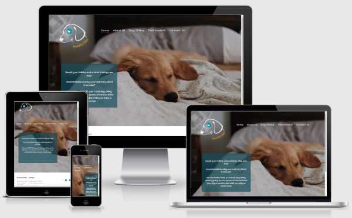
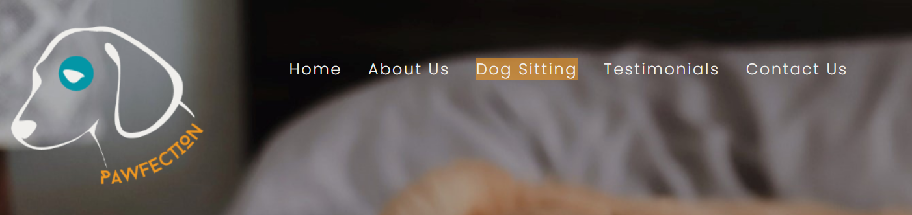
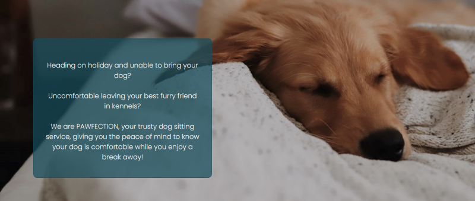
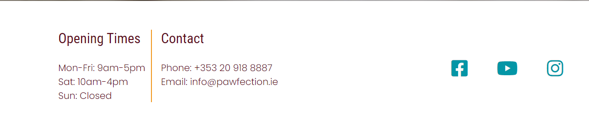
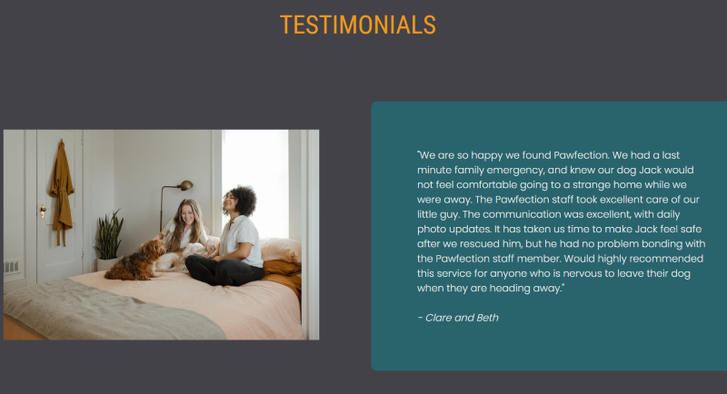
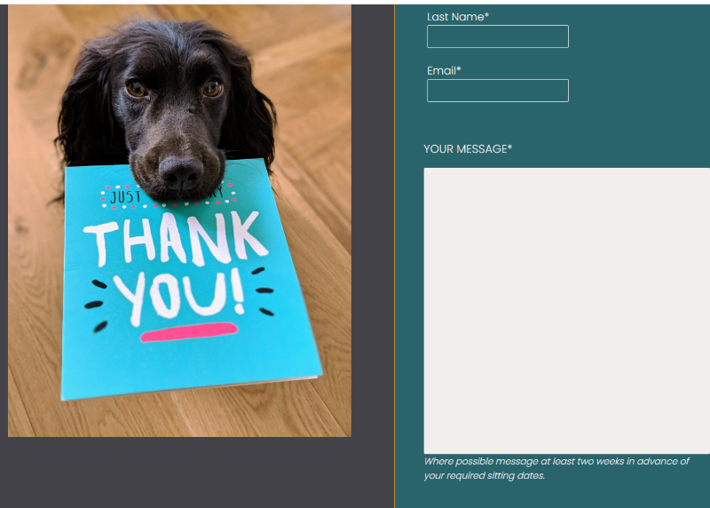
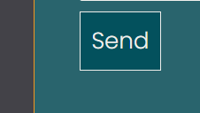
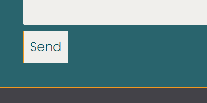
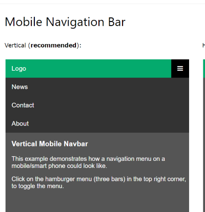

# PAWFECTION

Pawfection is a dog sitting service based in Galway, Ireland. The company was started after the founders realised there was a growing need for  an alternative to dog kennels for owners needing a place for their dog to stay while they go on holiday. 

Pawfection is aimed at dog owners in the Galway area, who may feel unsure and stressed about what to do with their dog when they go on holiday, or if they have an unforseen event that pops up and they need to find someone to sit their dog last minute. The services are highlighted clearly, with two options: our staff sitting the dog at the owners' home, or our staff sitting the dog in their home.

## Features

### Existing Features

#### LOGO

 
I made the logo using Canva with this:

[Logo Template](https://www.canva.com/templates/EAEmw6OtL8Q-pet-shelter-logo/).

 The colors are warm and inviting, and are also used throughout the site. The logo is intuitive as it is also a clickable link to bring the user back to the homepage.
 
 

#### NAVIGATION BAR

 
The navigation bar is displayed clearly at the top and center of each page. It is the same throughout the site and takes the user between the Home page, the About Us page, Dog sitting page, Testimonials page, and Contact page.
 

The navigation bar has a bottom border style applied to show the user which page they are currently on, and a hover psuedo class which impliments a background color and border bottom style when the user hovers over each page link.
 

 
 

#### BACKGROUND IMAGE

 

 
The  Home Page background shows a dog sleeping on it's owners bed with a transparent text overlay giving a brief but precise overview of the business. The colors aren't too distracting, and the image is cosy and inviting.

 
 

#### FOOTER

 
The footer is displayed at the bottom of each page, and uses a simple vertical line to divide up the contact information and opening hours to the left.
 
On the right social media links are displayed and the links will open in a new tab for ease of navigation.
 
 

 
 

#### FLEX DISPLAY IMAGES WITH TEXT BOXES

 
The About Us, Dog Sitting, and Testimonials pages have a simple design layout with warm colors, and images that compliment the text to give the user a positive sense of the business and its' ethos.
 
 
 Class attributes are used so that the style is consistent throughout the site. There are 4 different class selectors:
 
 
- One for a blue colored text box.
 
- One for the accompanying image.
 
- One for a gold colored text box.
 
- One for the accompanying image.
 
 
For ease of use the display: flex layout is used so that each of these pages can be efficiently targeted for responsiveness.
 
 

 
 

#### THE ABOUT US PAGE

 
The About us page gives a short description of how the business was formed, i.e that it met a need in the market for alternatives to dog kennels. For potential customers this information is vital so they are aware of the type of service provided.
 
 
There is also a section on the business ethos which further highlights the uniqueness of the business.
 
 

#### DOG SITTING PAGE

 
The Dog Sitting page utilizes the simple image and text box display to seperate the two types of dog sitting service the business provides:
 
 
- Dog sitting in the owners' own home.
 
- Dog sitting in one of the Pawfections staffs' homes.
 
 
At the bottom of the Dog Sitting page there is a gold colored horizontal rule to divide the main content from an additional feature. This feature is an internal link button that takes the user to the contact page. This makes it quick for the user to submit a dog sitting request once they have just read about the services provided
 
 

 #### TESTIMONIALS PAGE
 

 
The Testimonials page offers two reviews from satisfied customers, and covers both options of dog sitting, in the owners' home and in a staff members' home.
 
 

#### CONTACT US PAGE

 
There is a contact form included on the site for potential customers to submit a message requesting more information, or to send details of dates when they need a dog sitter.
 
 

 
 
The form only allows the user to hit send once all fields are completed, and the name and email fields will only accept text or email format as requested.
 
 
The send button is styled with a hover psuedo class, so the experience is more interactive for the user.
 
 

 
 

 

### FEATURES LEFT TO IMPLEMENT

I would like to change the navigation bar when the site is used on a smaller device. Rather than have the menu shrink in size and move underneath the logo, I want to implement a hamburger mobile menu so that the user can easily hover over and see all of the navigation links. This would make the mobile design more sleek and polished. (example below from WSSchools)
 
 

### TESTING

 

/* input testing information here */

 

#### VALIDATOR TESTING

 
HTML
 

-No issues were returned when passing through the [Offical WSC validator](https://validator.w3.org/nu/?doc=https%3A%2F%2Fkreilly86.github.io%2Fp1-pawfection)
 

CSS

-No issues were returned when passing through the official [(Jigsaw)validator](https://jigsaw.w3.org/css-validator/validator?uri=https%3A%2F%2Fkreilly86.github.io%2Fp1-pawfection%2F&profile=css3svg&usermedium=all&warning=1&vextwarning=&lang=en)
 
 

### DEPLOYMENT

 
The site was deployed to GitHub pages. The steps to deploy are the following:
 
 
In the GitHub repository, navigate to the Settings tab
and click on'Pages'. Select the Main Branch. Once the main branch has been selected, the page will be automatically refreshed with a detailed ribbon display to indicate the successful deployment.
 
 
The live link can be found here 

[Pawfection](https://kreilly86.github.io/p1-pawfection)

### CREDITS

Throughout the project I made use of tutorials and advice from the following websites:
 
 

*   [Code Institute](https://codeinstitute.net)

*   [W3Schools](https://www.w3schools.com/)

*   [Codecademy](https://www.codecademy.com/)
*   []

 
 

#### CONTENT
 
-The social media icons used in the footer, and the icons on the Dog Sitting Page were taken from 

[Font Awesome](http.s//fontawesome.com)
 
 
- The fonts I used in my site were Roboto Condensed, and Poppins which I took from Google Fonts.
 
 
- I tested the site color scheme using contrast grid from 
[Eight Shapes](https://contrast-grid.eightshapes.com/?version=1.1.0&background-colors=&foreground-colors=%230396a6%0D%0A%23f0efec%0D%0A%23590817%0D%0A%23f19820%0D%0A%23434248%0D%0A%2303515D%0D%0A%23154D5C%0D%0A%0D%0A%0D%0A%0D%0A%0D%0A%0D%0A%0D%0A%0D%0A%0D%0A%0D%0A%0D%0A%0D%0A%0D%0A&es-color-form__tile-size=regular&es-color-form__show-contrast=aaa&es-color-form__show-contrast=aa&es-color-form__show-contrast=aa18&es-color-form__show-contrast=dnp)
 
 

#### MEDIA
 
-All images are taken from the free image site 

[Unsplash](https://unsplash.com/)

